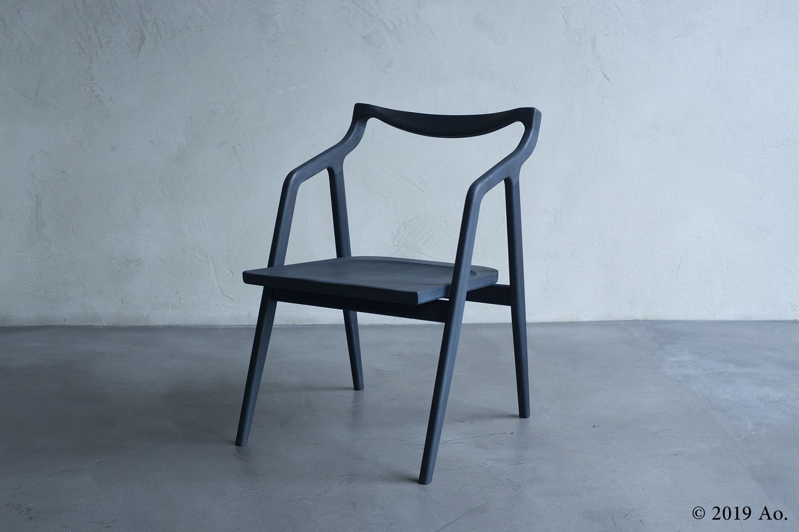
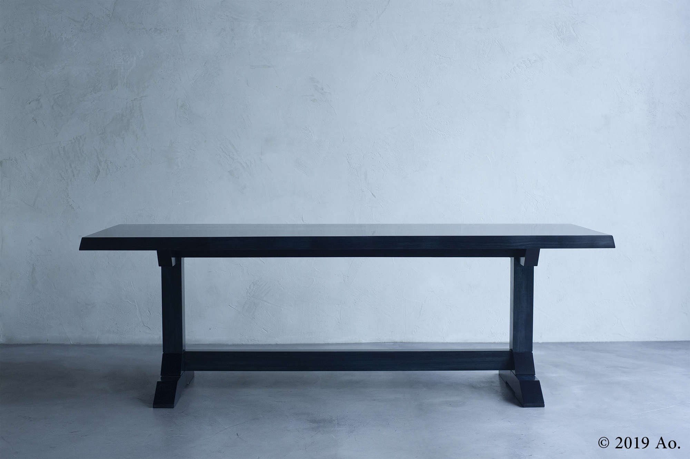
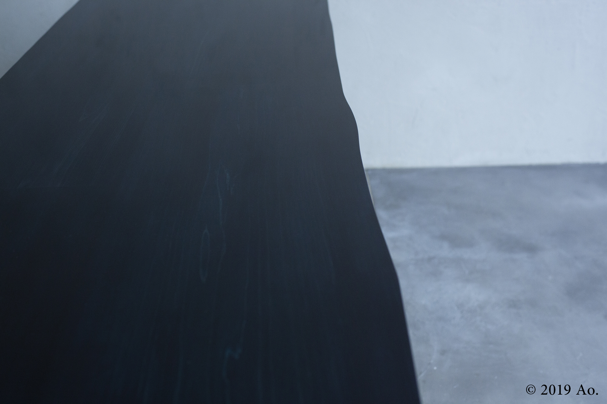
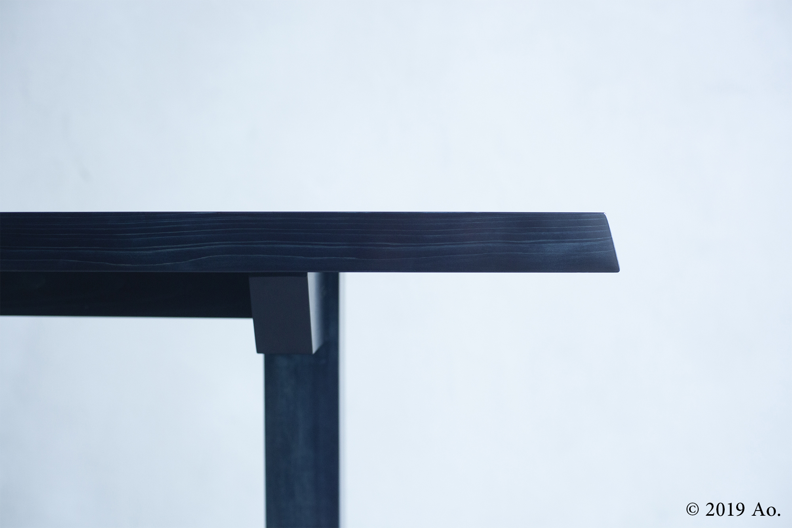
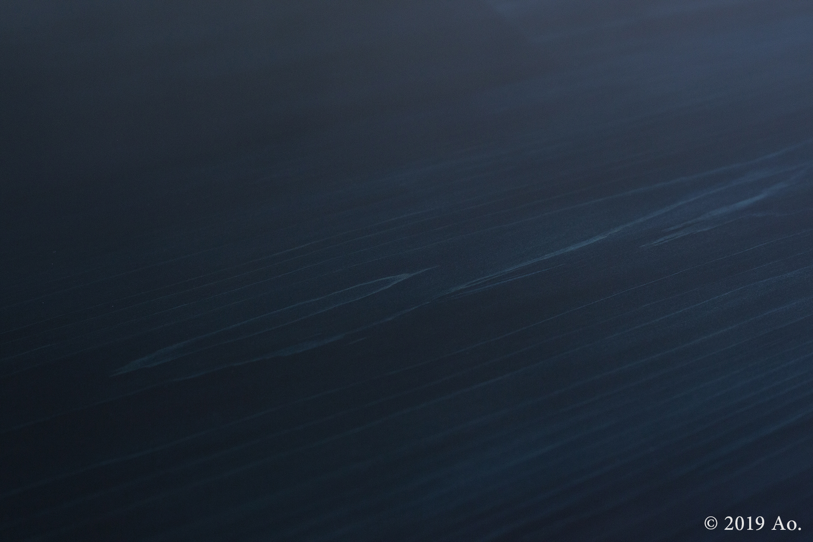
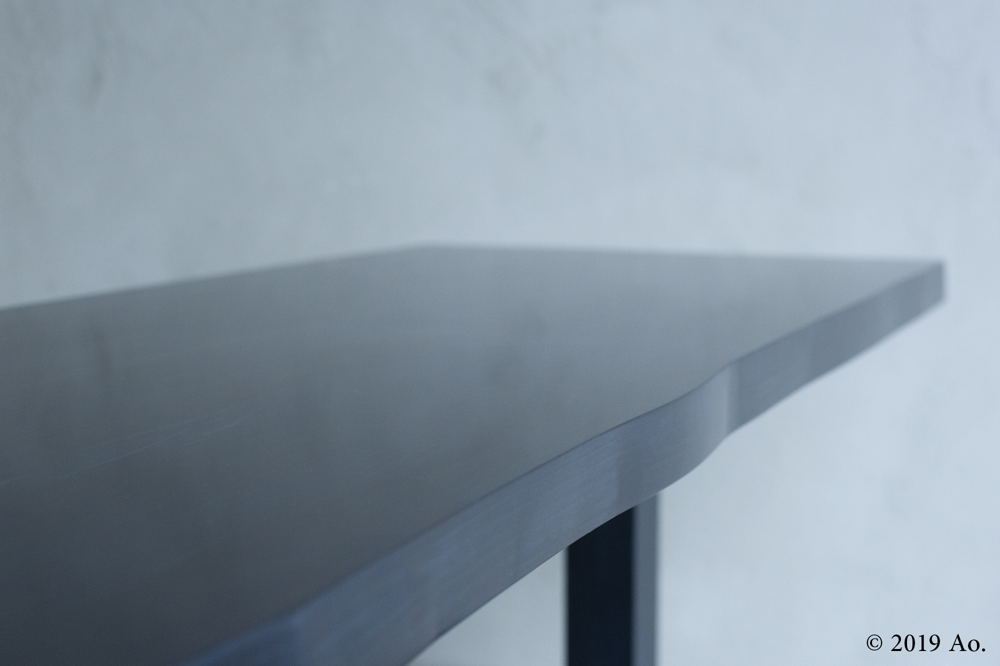
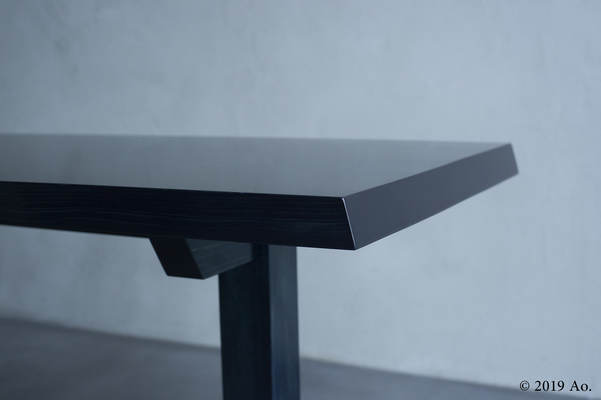
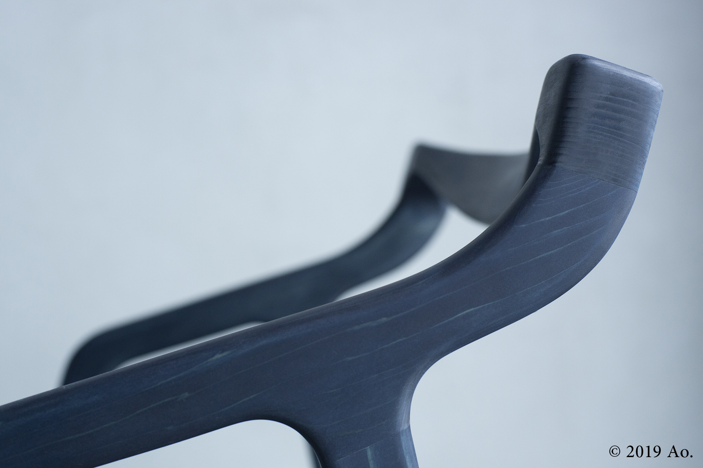
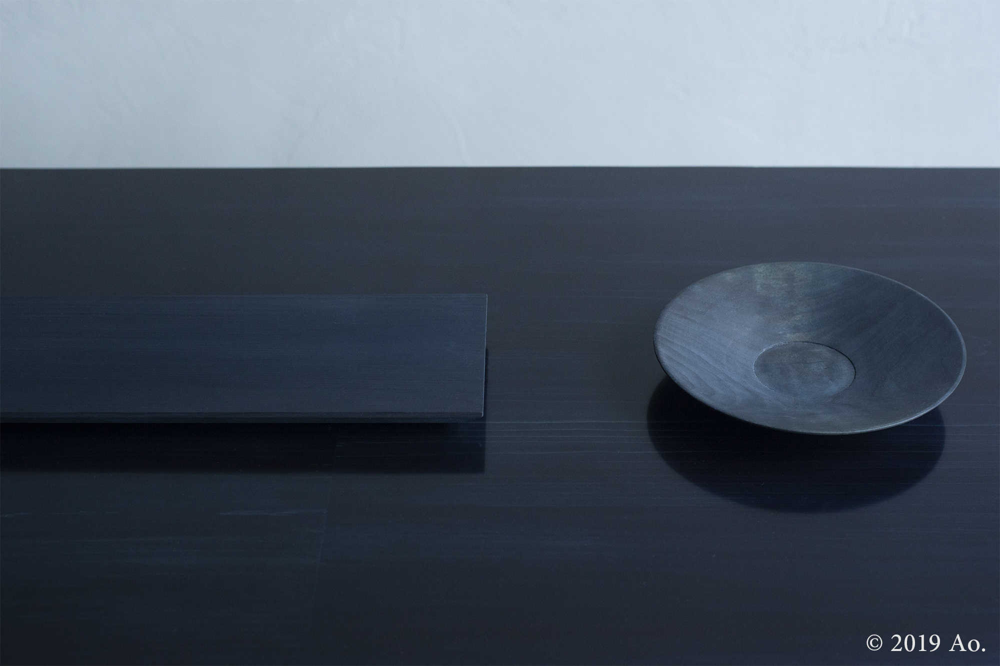
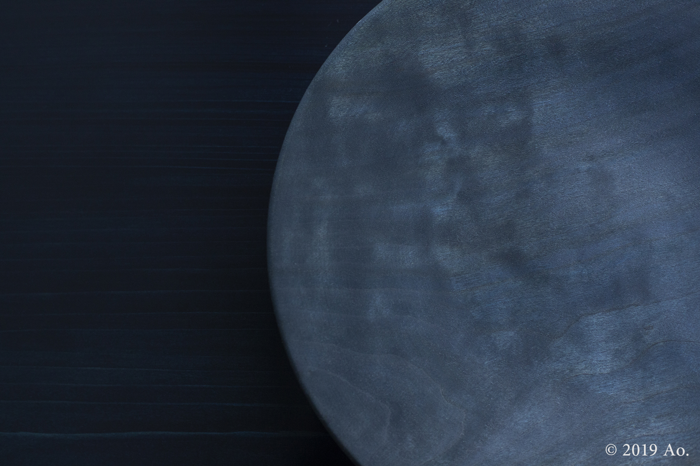

# Ao.

- 元URL: https://www.fs-kokkok.com/project-ao
- 種別: PROJECT（什器・家具の事例）
- 年: 2019

## クレジット

| 項目 | 内容 |
|---|---|
| design | KOKKOK |
| manufacture | KOKKOK |
| collaborator | anova design |
| photo | NOJYO |

※ Wixのページでは項目名と内容が別々のテキスト枠に置かれていたため、組み合わせは表示位置から推定しています（原文のまま、表記ゆれも保持）。

## 本文

Ao.は、anova design, incとfurniture studio KOKKOKとの共同プロジェクトとして2018年に始動しました。世界最古の染料といわれる藍により染色された無垢材に、創造的な意匠を施すことで、独自のコンテンポラリーなデザイン家具をつくりだします。

http://ao-design.tokyo/jp/

## 画像（10枚・Wixの元サイズ）

| # | ファイル | 元のWix画像ID | ピクセル |
|---|---|---|---|
| 1 | [project-ao_01.jpg](project-ao_01.jpg) | `f79438_2f5d1918847e41e18bb05df021da2a23~mv2_d_2000_1333_s_2.jpg` | 2000x1333 |
| 2 | [project-ao_02.jpg](project-ao_02.jpg) | `f79438_90356d6532954b46a95b4c0ec5917fe6~mv2_d_2000_1333_s_2.jpg` | 2000x1333 |
| 3 | [project-ao_03.jpg](project-ao_03.jpg) | `f79438_30b2129635cb4f648c009fb648736839~mv2_d_2000_1333_s_2.jpg` | 2000x1333 |
| 4 | [project-ao_04.jpg](project-ao_04.jpg) | `f79438_2467057b4a604962807f611a01702a1a~mv2_d_2000_1333_s_2.jpg` | 2000x1333 |
| 5 | [project-ao_05.jpg](project-ao_05.jpg) | `f79438_3eb764e8dba74f2b8125d1847cac3b12~mv2_d_2000_1333_s_2.jpg` | 2000x1333 |
| 6 | [project-ao_06.jpg](project-ao_06.jpg) | `f79438_066a64b438c14318b237e0cb16ca4a56~mv2_d_2000_1333_s_2.jpg` | 2000x1333 |
| 7 | [project-ao_07.jpg](project-ao_07.jpg) | `f79438_2e59d21727704dac82b90eeab762d55a~mv2_d_2000_1333_s_2.jpg` | 2000x1333 |
| 8 | [project-ao_08.jpg](project-ao_08.jpg) | `f79438_3c0e143182f74cd390c38bc3cc6b81c4~mv2_d_2000_1333_s_2.jpg` | 2000x1333 |
| 9 | [project-ao_09.jpg](project-ao_09.jpg) | `f79438_7752e48ed0474601a2877eac9c93d57e~mv2_d_2000_1333_s_2.jpg` | 2000x1333 |
| 10 | [project-ao_10.jpg](project-ao_10.jpg) | `f79438_497bf3d334194003b05f35ab4551ec3e~mv2_d_2000_1333_s_2.jpg` | 2000x1333 |

