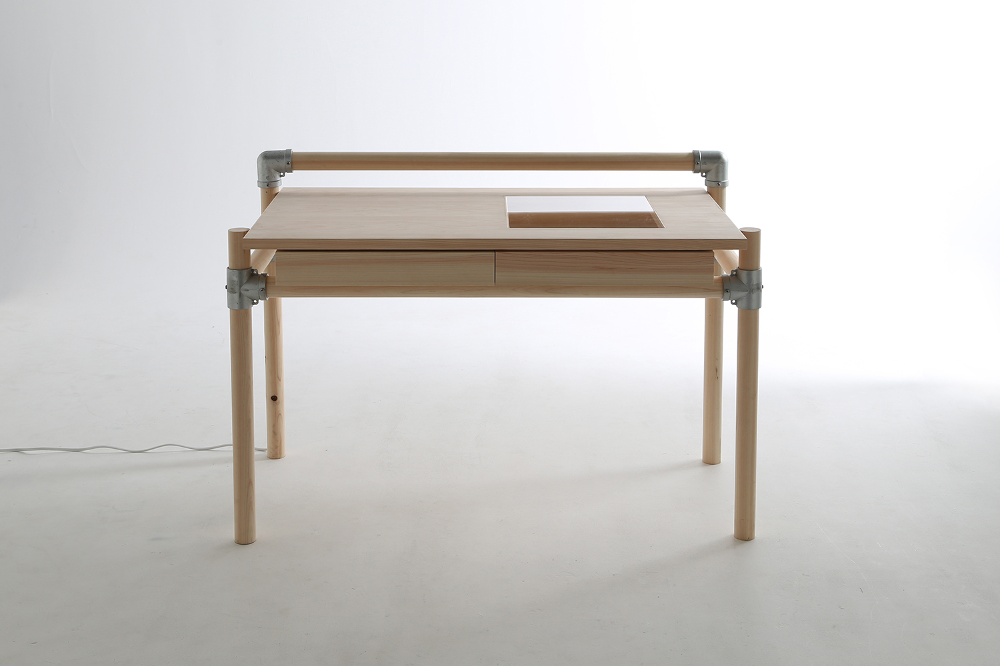
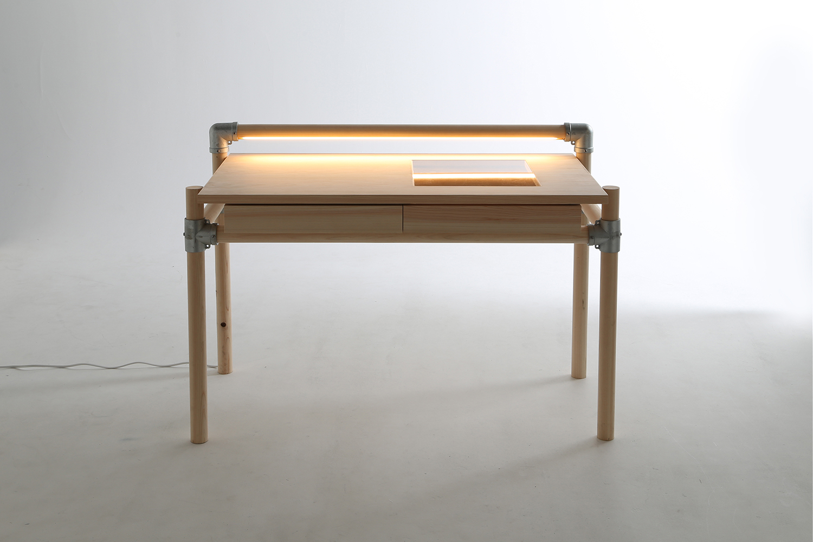
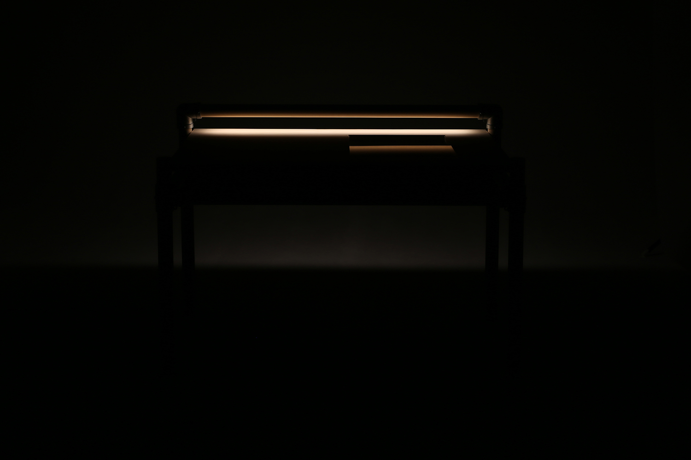
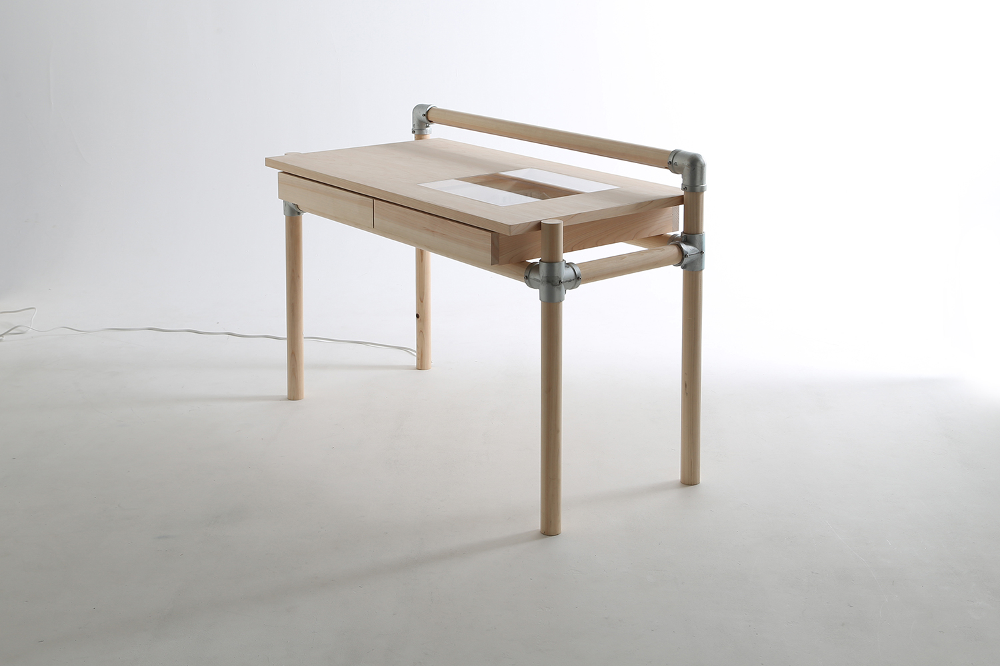
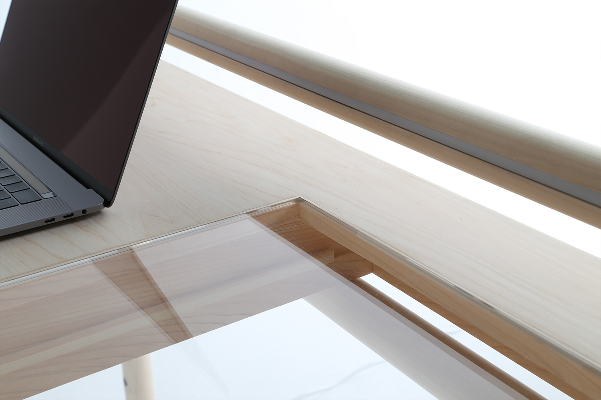
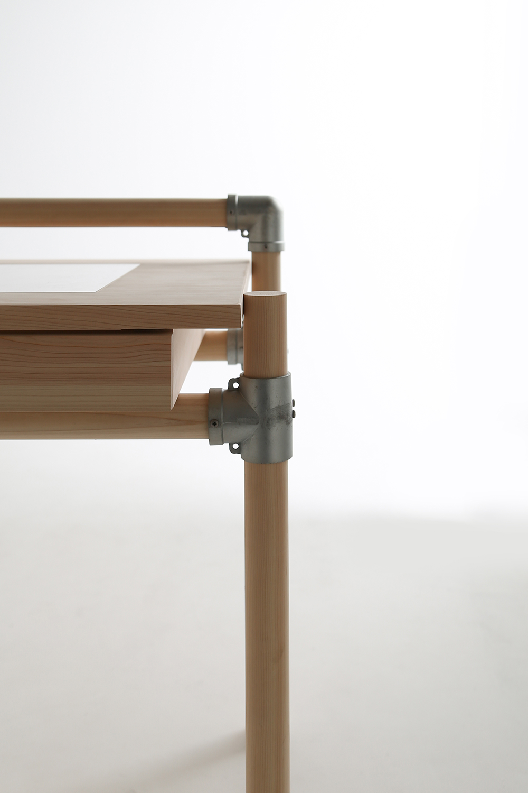
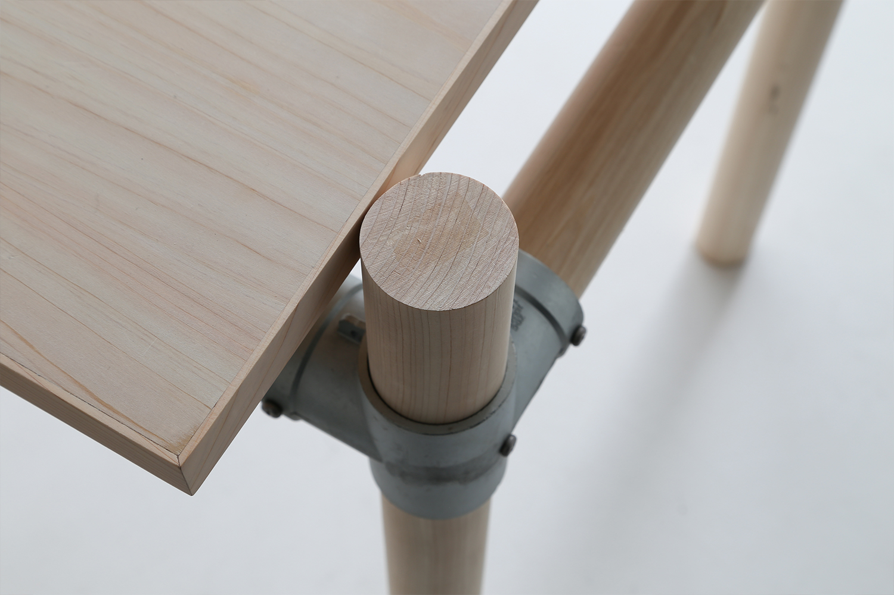
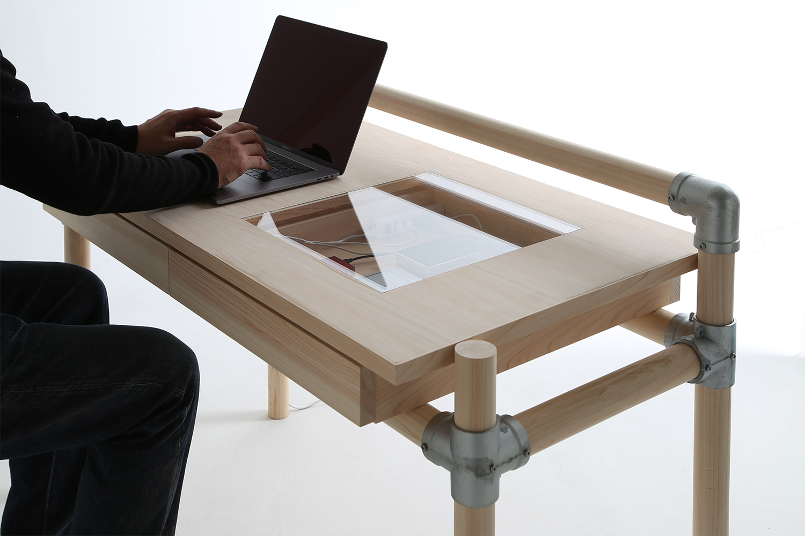

# CONSENTABLE /mok

- 元URL: https://www.fs-kokkok.com/project-consentable
- 種別: PROJECT（什器・家具の事例）
- 年: 2018

## クレジット

| 項目 | 内容 |
|---|---|
| design | 梶谷拓生 |
| manufacture | KOKKOK |
| collaborator | モクタンカン |

※ Wixのページでは項目名と内容が別々のテキスト枠に置かれていたため、組み合わせは表示位置から推定しています（原文のまま、表記ゆれも保持）。

## 本文

生木の丸太を乾燥・製材をせずにそのまま加工して制作制作した。

伐採後、市場で売値のつかない木材を活用するプロダクト。

## 画像（8枚・Wixの元サイズ）

| # | ファイル | 元のWix画像ID | ピクセル |
|---|---|---|---|
| 1 | [project-consentable_01.jpg](project-consentable_01.jpg) | `f79438_215be2ff6e76489fafdde1a469eefffa~mv2.jpg` | 1500x1000 |
| 2 | [project-consentable_02.jpg](project-consentable_02.jpg) | `f79438_33a6635408c3403cae55360971f4df49~mv2.jpg` | 1500x1000 |
| 3 | [project-consentable_03.jpg](project-consentable_03.jpg) | `f79438_35cefc81316140c082b13243a100d03b~mv2.jpg` | 1500x1000 |
| 4 | [project-consentable_04.jpg](project-consentable_04.jpg) | `f79438_1ab5cc3e08ba4cda8b07ea3bc68d3f48~mv2.jpg` | 1500x1000 |
| 5 | [project-consentable_05.jpg](project-consentable_05.jpg) | `f79438_f791851192fd4cfba0c8c96f94790834~mv2.jpg` | 1500x1000 |
| 6 | [project-consentable_06.jpg](project-consentable_06.jpg) | `f79438_a0c409a2237c47b19838b5597e9aa074~mv2.jpg` | 1000x1500 |
| 7 | [project-consentable_07.jpg](project-consentable_07.jpg) | `f79438_a39114877cc7431e8d2186c6975784a9~mv2.jpg` | 1500x1000 |
| 8 | [project-consentable_08.jpg](project-consentable_08.jpg) | `f79438_56d8f0ca417449e1994265d0c6f6de29~mv2.jpg` | 1500x1000 |

