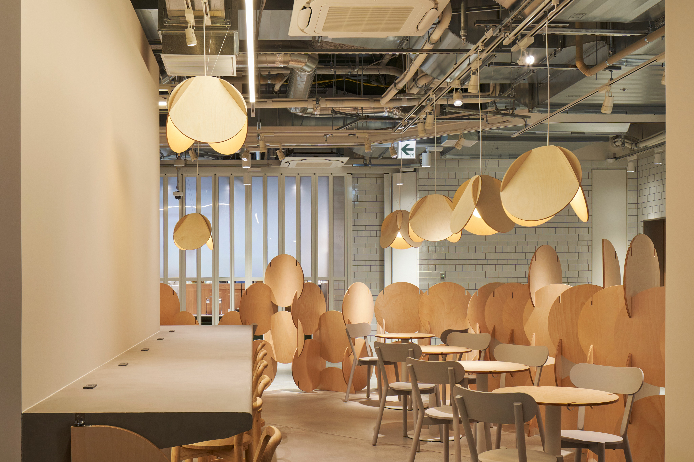
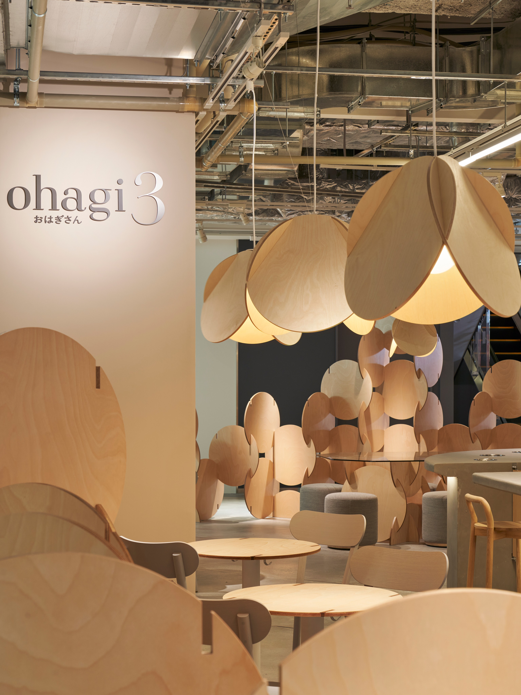
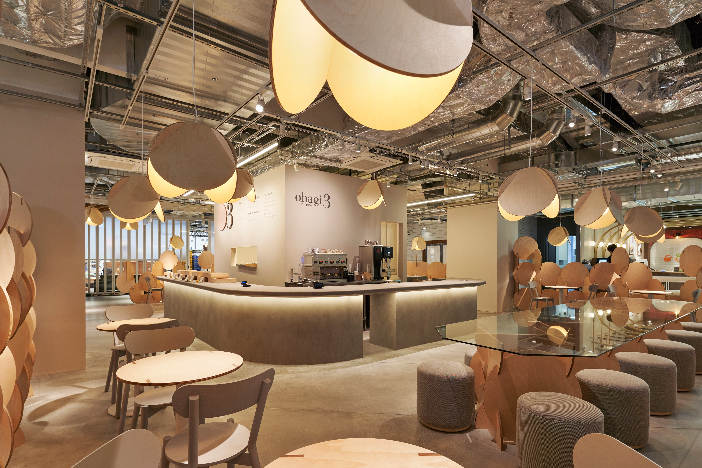

# ohagi3 ランプシェード

- 元URL: https://www.fs-kokkok.com/project-ohagi3
- 種別: PROJECT（什器・家具の事例）
- 年: 2022

## クレジット

| 項目 | 内容 |
|---|---|
| design | カミヤアーキテクツ |
| sample / manufacture | KOKKOK |
| photo | 黒岩 翼 |

※ Wixのページでは項目名と内容が別々のテキスト枠に置かれていたため、組み合わせは表示位置から推定しています（原文のまま、表記ゆれも保持）。

## 画像（3枚・Wixの元サイズ）

| # | ファイル | 元のWix画像ID | ピクセル |
|---|---|---|---|
| 1 | [project-ohagi3_01.jpg](project-ohagi3_01.jpg) | `f79438_e6a1a92a0e934be8ba608f869855dac0~mv2.jpg` | 4096x2731 |
| 2 | [project-ohagi3_02.jpg](project-ohagi3_02.jpg) | `f79438_b952cacdcdfd4484a3622ca649501562~mv2.jpg` | 3071x4096 |
| 3 | [project-ohagi3_03.jpg](project-ohagi3_03.jpg) | `f79438_d322ab0ef23740c8a4f7f7f5b86d125e~mv2.jpg` | 4096x2731 |

