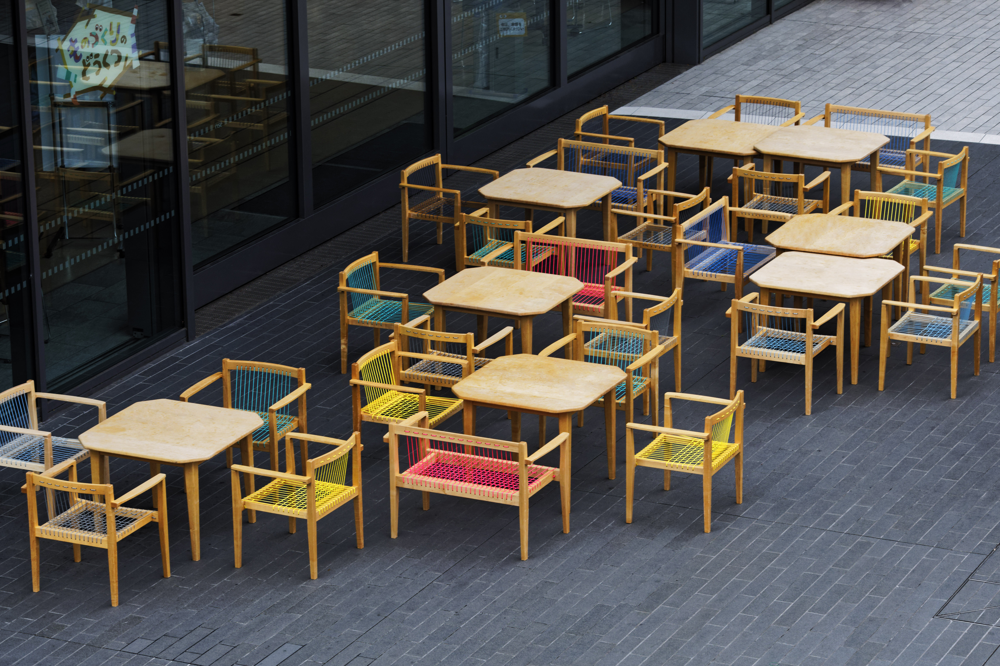
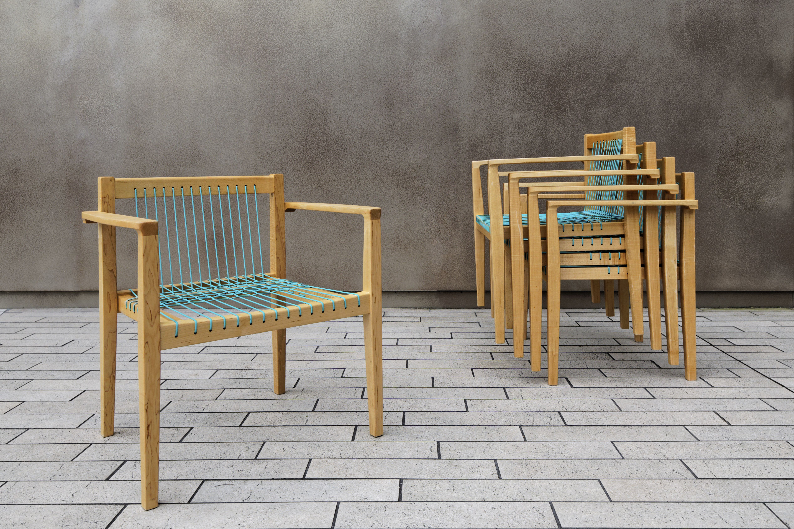
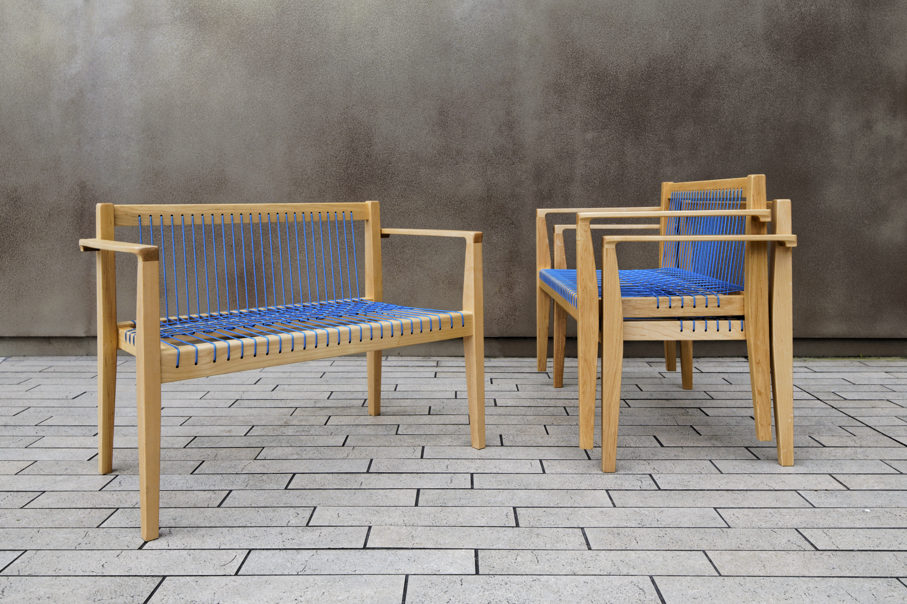
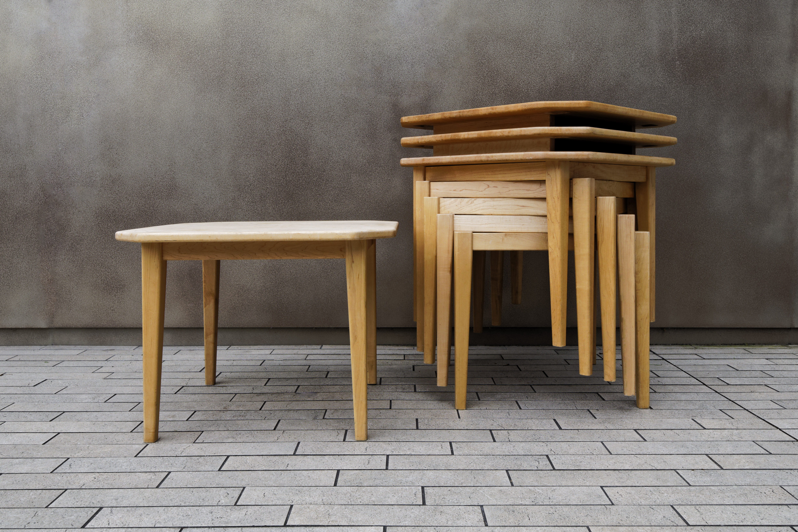
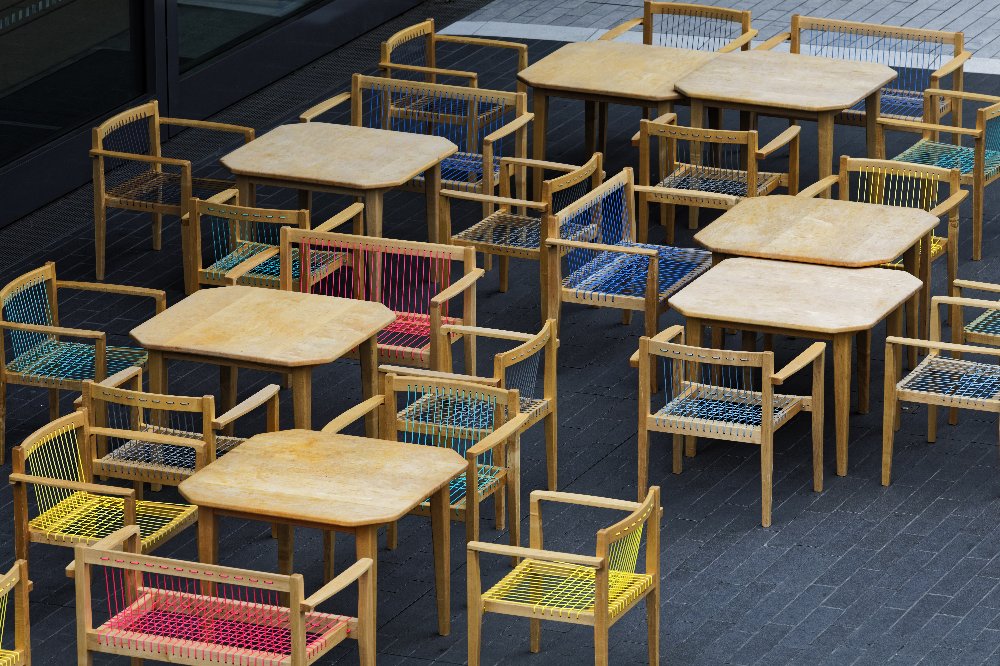

# RISE中央広場 屋外家具

- 元URL: https://www.fs-kokkok.com/project-rise
- 種別: PROJECT（什器・家具の事例）
- 年: 2016

## クレジット

| 項目 | 内容 |
|---|---|
| design | KOKKOK |
| manufacture | KOKKOK |
| collaborator | 10T株式会社 |
| photo | 黒部駿人 |

※ Wixのページでは項目名と内容が別々のテキスト枠に置かれていたため、組み合わせは表示位置から推定しています（原文のまま、表記ゆれも保持）。

## 本文

都内のショッピングモール「二子玉川ライズ」の中央広場に向けて屋外家具を設計制作した。特にファミリー層に使いやすいよう高さを一般的な椅子やテーブルよりも低く設定し、子どもにも使いやすく、大人が座ると安楽性が高くなるようにデザインした。椅子の背中と座面は屋外仕様に耐えうるようにアウトドアロープを使用し、それにより重量も軽く仕上がっている。椅子、テーブル全てスタッキングして収納できるようになっている。

## 画像（5枚・Wixの元サイズ）

| # | ファイル | 元のWix画像ID | ピクセル |
|---|---|---|---|
| 1 | [project-rise_01.jpg](project-rise_01.jpg) | `f79438_78cb5bdeeca24db7bf3157b619aadc14~mv2_d_5650_3768_s_4_2.jpg` | 5650x3768 |
| 2 | [project-rise_02.jpg](project-rise_02.jpg) | `f79438_4d83f10fb747490880885cc8abc7f853~mv2_d_5074_3384_s_4_2.jpg` | 5074x3384 |
| 3 | [project-rise_03.jpg](project-rise_03.jpg) | `f79438_53fbc248f3b14b3e9b17de92db53dc1f~mv2_d_5038_3359_s_4_2.jpg` | 5038x3359 |
| 4 | [project-rise_04.jpg](project-rise_04.jpg) | `f79438_bfa86d8977ee40a0a307473891305603~mv2_d_4912_3275_s_4_2.jpg` | 4912x3275 |
| 5 | [project-rise_05.jpg](project-rise_05.jpg) | `f79438_2ffb649461e04c47bfcdf3aaf9ca80b1~mv2_d_6720_4480_s_4_2.jpg` | 6720x4480 |

