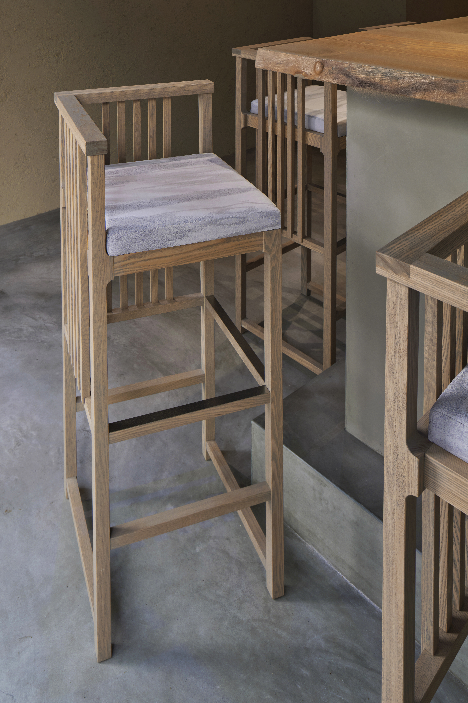
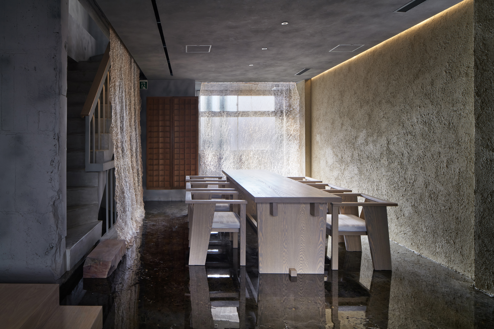
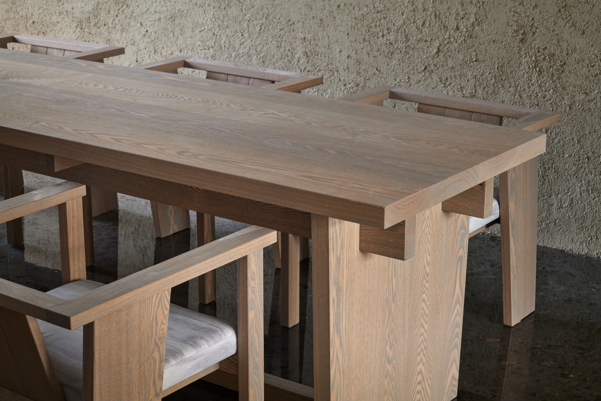
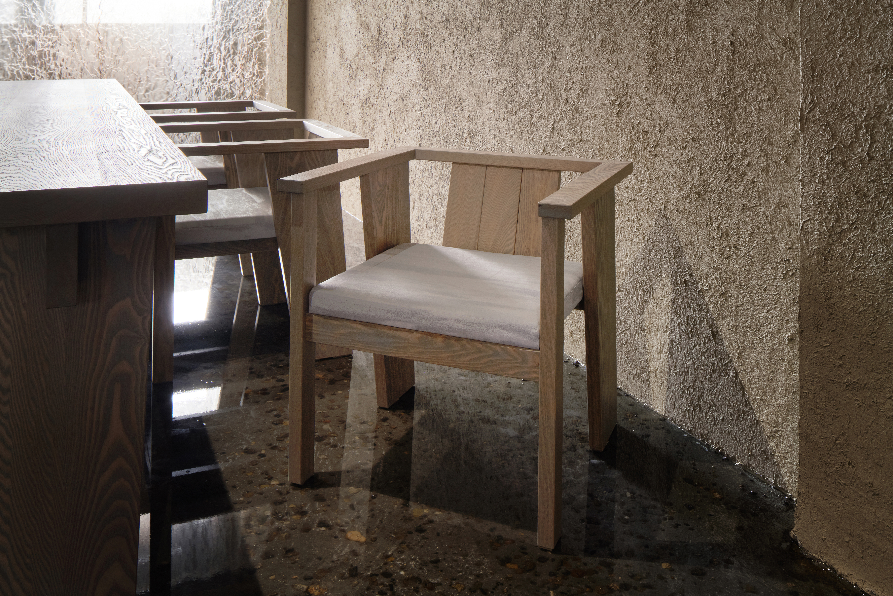
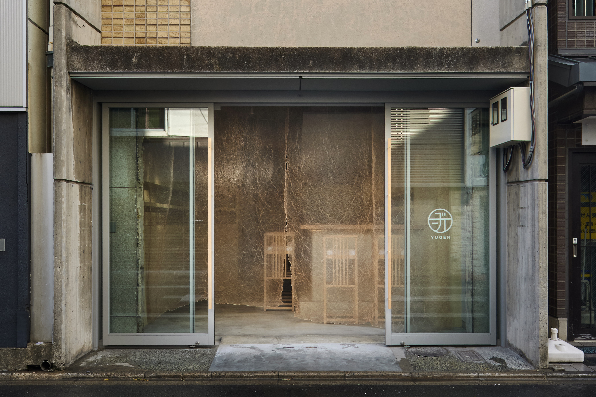

# YUGEN

- 元URL: https://www.fs-kokkok.com/project-yuugen
- 種別: PROJECT（什器・家具の事例）
- 年: 2021

## クレジット

| 項目 | 内容 |
|---|---|
| architecture | 菅野 正太郎 |
| furniture | KOKKOK |
| photo | 楠瀬 友将 |

※ Wixのページでは項目名と内容が別々のテキスト枠に置かれていたため、組み合わせは表示位置から推定しています（原文のまま、表記ゆれも保持）。

## 画像（10枚・Wixの元サイズ）

| # | ファイル | 元のWix画像ID | ピクセル |
|---|---|---|---|
| 1 | [project-yuugen_01.jpg](project-yuugen_01.jpg) | `f79438_00a2c1ef912641f8b63595480b09f63c~mv2.jpg` | 8368x5584 |
| 2 | [project-yuugen_02.jpg](project-yuugen_02.jpg) | `f79438_77c89cc28bf9484da7ff3c7b1290e553~mv2.jpg` | 7397x4932 |
| 3 | [project-yuugen_03.jpg](project-yuugen_03.jpg) | `f79438_6def51dd04794009808f9a5c3fdcbd7c~mv2.jpg` | 4088x6132 |
| 4 | [project-yuugen_04.jpg](project-yuugen_04.jpg) | `f79438_d1897139865c419ca93a2d1fac97b369~mv2.jpg` | 6276x4188 |
| 5 | [project-yuugen_05.jpg](project-yuugen_05.jpg) | `f79438_dadcf9da488c4d79b5207b7bbeefd811~mv2.jpg` | 6276x4188 |
| 6 | [project-yuugen_06.jpg](project-yuugen_06.jpg) | `f79438_bd839e0431e143c9b63d840de5a8f9af~mv2.jpg` | 6276x4188 |
| 7 | [project-yuugen_07.jpg](project-yuugen_07.jpg) | `f79438_0c367a83945b4517868e6d89784ad902~mv2.jpg` | 6276x4188 |
| 8 | [project-yuugen_08.jpg](project-yuugen_08.jpg) | `f79438_600a53744fde4618b64f170e020c0ce8~mv2.jpg` | 4155x2770 |
| 9 | [project-yuugen_09.jpg](project-yuugen_09.jpg) | `f79438_9878224053f1469dbdd113346ef7afe8~mv2.jpg` | 7947x5298 |
| 10 | [project-yuugen_10.jpg](project-yuugen_10.jpg) | `f79438_c6b4ecb796ab42f7bb2e7ba218917c20~mv2.jpg` | 8368x5584 |

